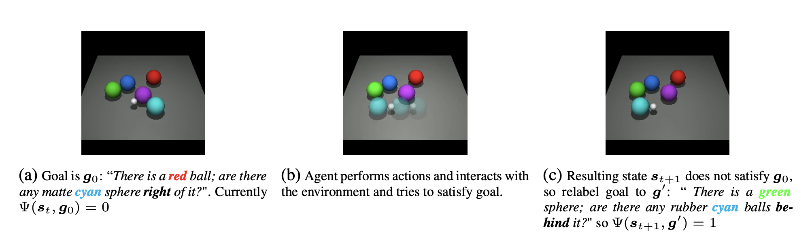
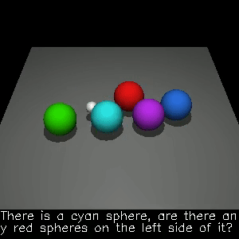
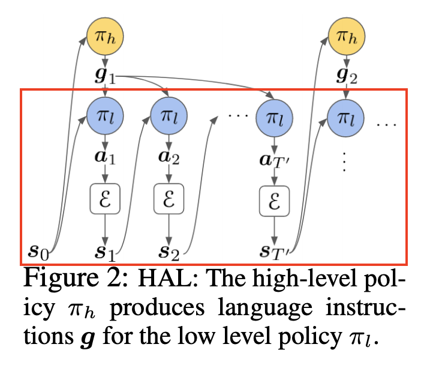

# Language-as-an-Abstraction-for-Hierarchical-Deep-Reinforcement-Learning
PyTorch implementation of [Language as an Abstraction for Hierarchical Deep Reinforcement Learning](https://arxiv.org/pdf/1906.07343.pdf).   
This paper uses language as the abstraction for Hierarchical Reinforcement Learning. Using this approach, agents can learn to
solve to diverse, temporally-extended tasks such as object sorting and multi-object rearrangement.

## Introduction
The proposed architecture has a 2-layer hierarchical policy with compositional language as the abstraction between the 
high-level policy and the low-level policy. This repository aims to replicate the results for low-level policy experiments (Figure 4 in the paper).   
   
The experiments include state-observations and raw-pixel observations. This repository only focuses on the state-based representation (Figure 7 in the paper).

||
|:---:|
|The environment and some instructions considered in this work| 

|  |
|:---:|
| Low-level policy trying to complete randomly sampled goals  |

### Installation and Running
The paper uses the [CLEVR-Robot environment](https://github.com/google-research/clevr_robot_env) which is built on top of the [MuJoCo](http://www.mujoco.org/) physics simulator. 
These libraries are required. PyTorch 1.3 is used.   
   
Simply running the main.py file starts the training.
   
Future Instruction Relabeling Strategy (Algorithm 4 in the paper) and the Computation graph of the state-based low level policy (Figure 7 in the paper) can be found in util.py 
   
DQN, Instruction Encoder and the ```f1``` network can be found in networks.py

| |
|:---:|
|Agent completing an instruction |

### Details 
||
|:---:|
|The part showed by the red box is implemented in this repository. The instructions are sampled randomly from the environment.| 

### References
- Yiding Jiang, Shixiang Gu, Kevin Murphy, and Chelsea Finn. Language as an Abstraction
for Hierarchical Deep Reinforcement Learning. In Workshop on “Structure & Priors in
Reinforcement Learning”at ICLR 2019, jun 2019. URL http://arxiv.org/abs/1906.07343.
